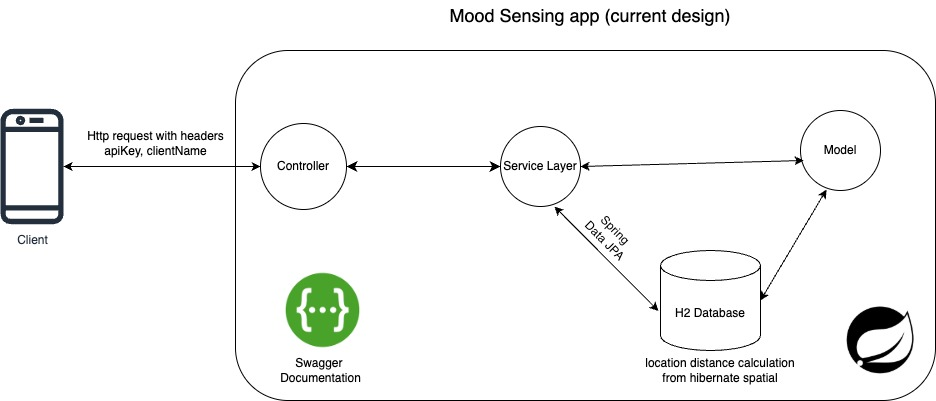
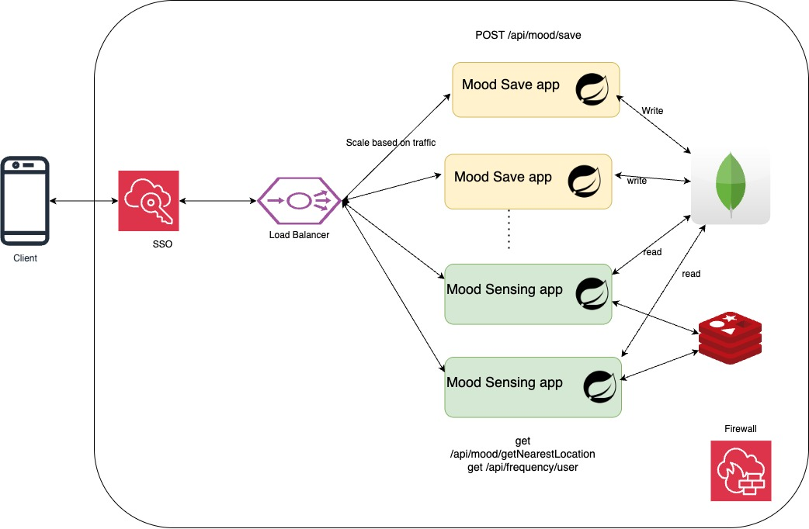

# Mood sensing app
It is web application that provides the apis to save users mood based on the location. It also provides
the closest location of user based on mood (Change this correctly)

## Features

- Upload a mood capture for a given user and location
- Return the mood frequency distribution for a given user
- Given the user’s current location, return the closest location where the user has been happy.

## Tech Stack

- **Backend**: Java, Spring Boot
- **Storage**: H2 db (In memory)


## Current Design



### Assumptions
- H2db is used assuming for quick setup. (since data is stored in memory it can take max 30 of container memory)
- Assuming the user current location is sent in the coordinates (for uploading mood & getting the nearest happy location)
- Spring security with role based authentication is implemented using api key (no user creation service. 
created some default users for testing purpose)

## Design Changes for scaling requirements


### Scaling Assumptions
- To start with assume: 10k users using the api, In one day we assume to capture 10 locations = 100 * 10 = 100k requests / per data

- DB: 1user = 0.1kb => 10k users = 1mb
100k userMood = 0.5kb => 50mb/day
One year:  50*365 = 17Gb (approx). 
- According to scaling requirements since data is not from critical domain we can use
mongodb which more scalable. Using GeoJSON, 2dsphere Index : the distance computations 
can be done faster as well
- To improve performance we can use Redis for Get `api/mood/frequency/:userId` & `api/mood/happy-location/:userId` can be cached
using expiry for cache & also based on the current location
- sso can be used with google or any other social media apps which can provide us with the
current location data of user
- Load balancer should be used for autoscaling based on the traffic for spring application
- App can ge sub divided to be more performant one specific to write operations and other
to read operations. So that they can be independently scalable, new features
can be added like uploading image to the upload which will use NNN model to detect 
the mood & save the image in blob storage for writer app and getting the nearest 20 locations of different
moods for the reader application. 


## Installation & Setup

### Backend (Java Spring Boot)

1. Move to the current directory:
   ```sh
   cd stem
   ```
2. Build the application jar:
   ```sh
   ./gradlew build
   ```
3. Create a docker image in local (Prerequisite docker needs to installed):
   ```sh
    docker build -t stem-mood-sensing-app:latest . #latest can be your version
   ```
4. Run the application using docker:
   ```sh
   docker run -dp 127.0.0.1:8080:8080 stem-mood-sensing-app:latest
   ```
   The backend will be available at `http://127.0.0.1:8080`

## API Endpoints 
#### Swagger is enabled you, can get detailed information over there

### Upload a new Mood for the user
#### Endpoint: `POST /api/mood/upload`
##### Payload:
```json
{
   "mood": "happy", <string> - can be happy, sad or neutral
   "userId": 20 , <long> - must be a valid userId
   "latitude": 22.4, <double>
   "longitude": 23.3 <double>
}
```
##### Response:
```
Mood uploaded successfully.
```

### Get the frequency distribution of the user
#### Endpoint: `Get /api/mood/frequency/<userId>`

##### Response:
```json
{
  "angry": <count of the angry mood for user>,
  "sad": <count of the sad mood for user>,
  "neutral": <count of the neutral mood for user>
}
```

### Get the closest happy location of the user
#### Endpoint: `Get /api/mood/happy-location/<userId>`
#### Request params: `latitude` - current location latitude point of user, `longitude` - current location longitude point of user

##### Response:
```json
{
  "latitude": <latitue of the location>,
  "longitude": <longitude of the location>,
  "distance": <distance from current location in spatial degrees will convert in kms future>
}
```


| Method | Endpoint                                        | Description                          |
|--------| ----------------------------------------------- | ------------------------------------ |
| POST   | `/api/mood/upload`                          | Upload a new Mood for the user            |
| GET    | `/api/mood/frequency/<userId>`            | Get the frequency distribution of the user  |
| GET    | `/api/mood/happy-location/<userId>`             | Get the closest happy location of the user |

## Running Tests

To run tests, run the following command inside root folder

```bash
  ./gradlew test
```


[//]: # (## Demo)

[//]: # ()
[//]: # (Check out the demo video: [Demo.mp4]&#40;./Demo.mp4&#41; &#40;need to be done&#41;)

## Author

Developed by **Sai Manoj**

---


